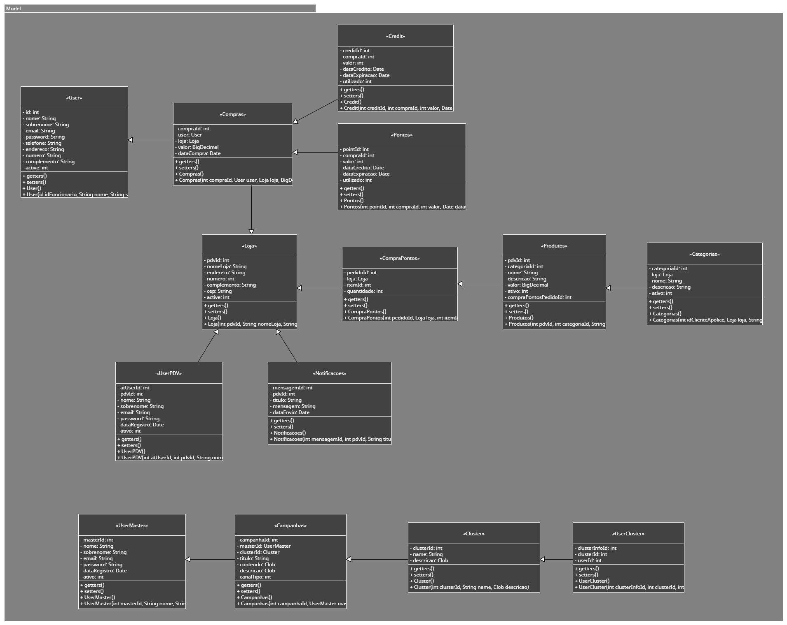
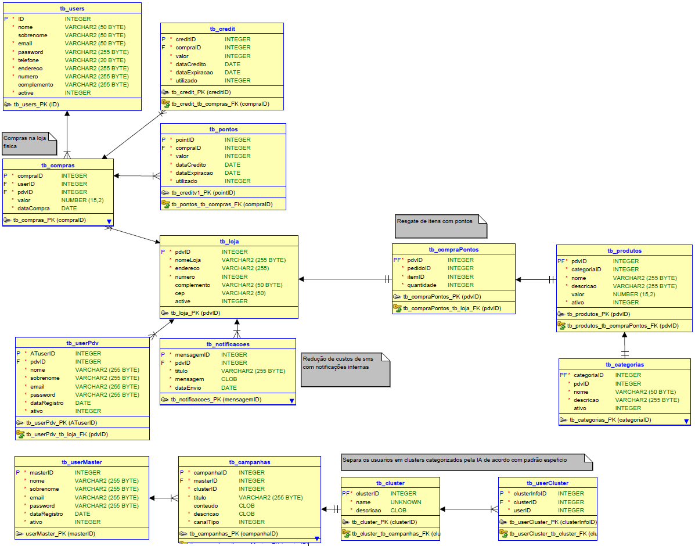

# - NOME DA APLICAÇÃO -

## Sumário
- [Integrantes;](#integrantes)
- [Documentação completa;](#documentação-completa)
- [Instruções para uso da aplicação;](#instruções-para-uso-da-aplicação)
- [Imagem dos diagramas de classe;](#imagem-dos-diagramas-de-classe)
- [Link para vídeo com a proposta tecnológica;](#link-para-vídeo-com-a-proposta-tecnológica)
- [Listagem de Endpoints.](#listagem-de-endpoints)

## Integrantes
- Beatriz Lucas - RM99104 (Responsável por atuar em Disruptive Architectures, Compliance & Quality Assurance e DevOps Tools & Cloud Computing);
- Enzo Farias - RM98792 (Responsável por atuar em Disruptive Architectures, Advanced Business Development with .NET, Java Advanced e Mobile App Development);
- Ewerton Gonçalves - RM98571 (Responsável por atuar em Mastering Relational and Non-Relational Database, Mobile App Development e DevOps Tools & Cloud Computing);
- Guilherme Tantulli - RM97890 (Responsável por atuar em Compliance & Quality Assurance, Advanced Business Development with .NET e Mobile App Development);
- Thiago Zupelli - RM99085 (Responsável por atuar em Disruptive Architectures, Advanced Business Development with .NET, Java Advanced e Mastering Relational and Non-Relational Database).

## Documentação completa
xfun::embed_file("TPC_JavaAdvanced_1stSprint.pdf")

## Instruções para uso da aplicação
### Iniciando a Aplicação

1. **Execução da Aplicação**:
    - Para iniciar a aplicação, você deve executar o arquivo **`TpcApplication.java`**. Isso pode ser feito diretamente dentro de sua IDE (Ambiente de Desenvolvimento Integrado) de preferência.
    - Localize o arquivo **`TpcApplication.java`** na pasta de projetos.
    - Clique com o botão direito no arquivo e selecione **`Run 'TpcApplication'`** ou use o atalho para executar o arquivo diretamente, geralmente encontrado na barra de ferramentas ou menu de contexto.
2. **Verificação do Servidor**:
    - Após executar a aplicação, verifique se o servidor foi iniciado corretamente observando a saída no console da IDE, que deve indicar que o Spring Boot está rodando na porta **`8080`**.

### Acesso ao Banco de Dados

1. **Acessando o Console do H2**:
    - Com a aplicação em execução, abra um navegador web e acesse **`http://localhost:8080/h2-console`** para abrir o console do banco de dados H2.
    - Na página de login do console H2, você precisará configurar a conexão JDBC para acessar o banco de dados em memória:
        - **JDBC URL**: Substitua a URL padrão pela URL específica do projeto: **`jdbc:h2:mem:tpcjava`**. Isso conectará ao banco de dados em memória denominado **`tpcjava`** que é configurado automaticamente quando a aplicação é iniciada.
        - **Usuário** e **Senha**: Se configurado, use as credenciais apropriadas. Para muitas configurações padrão do H2, a senha pode ser deixada em branco.
2. **Interagindo com o Banco de Dados**:
    - Dentro do console H2, você pode executar comandos SQL para consultar ou modificar dados. Por exemplo, após fazer mudanças via sua aplicação, você pode verificar os efeitos dessas mudanças no banco de dados executando um comando **`SELECT`** apropriado.
    - Use a área de consulta SQL no console H2 para inserir, atualizar, ou deletar dados manualmente, o que pode ser útil para testes rápidos ou manipulação de dados durante o desenvolvimento.

**Utilização da API**

### Exemplos de Requisições para a API

Aqui estão exemplos de como interagir com cada tipo de recurso:

**1. Users**

- **Listar todos os usuários**
    
    ```bash
    GET http://localhost:8080/users
    
    ```
    
- **Buscar um usuário pelo ID**
    
    ```bash
    GET http://localhost:8080/users/{id}
    
    ```
    
- **Criar um novo usuário**
    
    ```bash
    POST http://localhost:8080/users
    -Header 'Content-Type: application/json'
    -data '{
      "nome": "Enzo",
      "sobrenome": "Farias",
      "email": "john@example.com",
      "password": "securepass",
      "telefone": "11947557509",
      "endereco": "Rua Fiap",
      "numero": "1377",
      "Complemento": " ",
      "active": true
    }'
    
    ```
    
- **Atualizar um usuário**
    
    ```bash
    PUT http://localhost:8080/users/{id}
    -Header 'Content-Type: application/json'
    -data '{
      "nome": "Enzo",
      "sobrenome": "Farias",
      "email": "updated@example.com",
      "password": "newsecurepass",
      "telefone": "11999999999",
      "endereco": "Nova Rua Fiap",
      "numero": "2000",
      "Complemento": "Apto 101",
      "active": true
    }'
    
    ```
    
- **Deletar um usuário**
    
    ```bash
    DELETE http://localhost:8080/users/{id}
    
    ```
    

**2. Produtos**

- **Listar todos os produtos**
    
    ```bash
    GET http://localhost:8080/produtos
    
    ```
    
- **Buscar um produto pelo ID**
    
    ```bash
    GET http://localhost:8080/produtos/{pdvId}
    
    ```
    
- **Criar um novo produto**
    
    ```bash
    POST http://localhost:8080/produtos
    -Header 'Content-Type: application/json'
    -data '{
      "categoriaId": 1,
      "nome": "Cafeteira Elétrica",
      "descricao": "Cafeteira com capacidade de 10 xícaras",
      "valor": 120.50,
      "ativo": 1,
      "compraPontosPedidoId": 2
    }'
    
    ```
    
- **Atualizar um produto**
    
    ```bash
    PUT http://localhost:8080/produtos/{pdvId}
    -Header: 'Content-Type: application/json'
    -data '{
      "categoriaId": 1,
      "nome": "Cafeteira Elétrica - Nova Geração",
      "descricao": "Nova cafeteira atualizada com capacidade para 15 xícaras",
      "valor": 150.75,
      "ativo": 1,
      "compraPontosPedidoId": 3
    }'
    
    ```
    
- **Deletar um produto**
    
    ```bash
    DELETE http://localhost:8080/produtos/{pdvId}
    
    ```
    

**3. Lojas, UserMaster, UserPDV, Notificações, Pontos, Compras, CompraPontos, e Campanhas**

- O formato para estes será similar ao descrito para Users e Produtos. Substitua o caminho do endpoint e os detalhes do corpo da requisição conforme apropriado para cada tipo de entidade. As operações incluirão listagem, busca por ID, criação, atualização e deleção.

### Respostas Esperadas

- **Sucesso**: As respostas para requisições bem-sucedidas incluirão os dados solicitados ou uma confirmação de sucesso.
    
    ```json
    
    {
      "status": "success",
      "data": {
        "id": 1,
        "nome": "Enzo",
        "sobrenome": "Farias",
        "email": "john@example.com",
        "telefone": "11947557509",
        "endereco": "Rua Fiap",
        "numero": "1377",
        "Complemento": " ",
        "active": true
      }
    }
    
    ```
    
- **Erro**: Respostas de erro fornecerão detalhes sobre o que deu errado.
    
    ```json
    
    {
      "status": "error",
      "message": "Usuário não encontrado.",
      "code": 404
    }
    
    ```
    

### Considerações Adicionais

- **Ambiente de Desenvolvimento**: Certifique-se de que sua IDE está configurada com o JDK apropriado para o projeto e com todas as dependências, definidas geralmente no **`pom.xml`** (Maven).

## Imagem dos diagramas de classe
UML:\


Banco de Dados:\


## Link para vídeo com a proposta tecnológica
[](http://www.youtube.com/watch?v=D7EWoFBEPvs)

## Listagem de Endpoints
### Endpoints para Users:
GET /users - Buscar todos os usuários.\
GET /users/{id} - Buscar um usuário pelo ID.\
POST /users - Criar um novo usuário.\
PUT /users/{id} - Atualizar um usuário existente.\
DELETE /users/{id} - Deletar um usuário pelo ID.\

### Endpoints para UserMaster:
GET /usermasters - Buscar todos os usuários mestres.\
GET /usermasters/{masterId} - Buscar um usuário mestre pelo ID.\
POST /usermasters - Criar um novo usuário mestre.\
PUT /usermasters/{masterId} - Atualizar um usuário mestre existente.\
DELETE /usermasters/{masterId} - Deletar um usuário mestre pelo ID.

### Endpoints para UserPDV:
GET /userpdv - Buscar todos os usuários PDV.\
GET /userpdv/{atUserId} - Buscar um usuário PDV pelo ID.\
POST /userpdv - Criar um novo usuário PDV.\
PUT /userpdv/{atUserId} - Atualizar um usuário PDV existente.\
DELETE /userpdv/{atUserId} - Deletar um usuário PDV pelo ID.

### Endpoints para Loja:
GET /lojas - Buscar todas as lojas.\
GET /lojas/{pdvId} - Buscar uma loja pelo ID.\
POST /lojas - Criar uma nova loja.\
PUT /lojas/{pdvId} - Atualizar uma loja existente.\
DELETE /lojas/{pdvId} - Deletar uma loja pelo ID.

### Endpoints para Produtos:
GET /produtos - Buscar todos os produtos.\
GET /produtos/{pdvId} - Buscar um produto pelo ID.\
POST /produtos - Criar um novo produto.\
PUT /produtos/{pdvId} - Atualizar um produto existente.\
DELETE /produtos/{pdvId} - Deletar um produto pelo ID.

### Endpoints para Credit:
GET /credits - Buscar todos os créditos.\
GET /credits/{creditId} - Buscar um crédito pelo ID.\
POST /credits - Criar um novo crédito.\
PUT /credits/{creditId} - Atualizar um crédito existente.\
DELETE /credits/{creditId} - Deletar um crédito pelo ID.

### Endpoints para Pontos:
GET /pontos - Buscar todos os pontos.\
GET /pontos/{pointId} - Buscar um ponto pelo ID.\
POST /pontos - Criar novos pontos.\
PUT /pontos/{pointId} - Atualizar um ponto existente.\
DELETE /pontos/{pointId} - Deletar um ponto pelo ID.

### Endpoints para UserCluster:
GET /usercluster - Buscar todas as associações UserCluster.\
GET /usercluster/{clusterInfoId} - Buscar uma associação UserCluster pelo ID.\
POST /usercluster - Criar uma nova associação UserCluster.
PUT /usercluster/{clusterInfoId} - Atualizar uma associação UserCluster existente.\
DELETE /usercluster/{clusterInfoId} - Deletar uma associação UserCluster pelo ID.

### Endpoints para Notificacoes:
GET /notificacoes - Buscar todas as notificações.\
GET /notificacoes/{mensagemId} - Buscar uma notificação pelo ID.\
POST /notificacoes - Criar uma nova notificação.\
PUT /notificacoes/{mensagemId} - Atualizar uma notificação existente.\
DELETE /notificacoes/{mensagemId} - Deletar uma notificação pelo ID.

### Endpoints para Compras:
GET /compras - Buscar todas as compras.\
GET /compras/{compraId} - Buscar uma compra pelo ID.\
POST /compras - Criar uma nova compra.\
PUT /compras/{compraId} - Atualizar uma compra existente.\
DELETE /compras/{compraId} - Deletar uma compra pelo ID.

### Endpoints para Campanhas:
GET /campanhas - Buscar todas as campanhas.\
GET /campanhas/{campanhaId} - Buscar uma campanha pelo ID.\
POST /campanhas - Criar uma nova campanha.\
PUT /campanhas/{campanhaId} - Atualizar uma campanha existente.\
DELETE /campanhas/{campanhaId} - Deletar uma campanha pelo ID.

### Endpoints para Categorias:
GET /categorias - Buscar todas as categorias.\
GET /categorias/{categoriaId} - Buscar uma categoria pelo ID.\
POST /categorias - Criar uma nova categoria.\
PUT /categorias/{categoriaId} - Atualizar uma categoria existente.\
DELETE /categorias/{categoriaId} - Deletar uma categoria pelo ID.

### Endpoints para Cluster:
GET /clusters - Buscar todos os clusters.\
GET /clusters/{clusterId} - Buscar um cluster pelo ID.\
POST /clusters - Criar um novo cluster.\
PUT /clusters/{clusterId} - Atualizar um cluster existente.\
DELETE /clusters/{clusterId} - Deletar um cluster pelo ID.

### Endpoints para CompraPontos:
GET /comprapontos - Buscar todas as compras de pontos.\
GET /comprapontos/{pedidoId} - Buscar uma compra de pontos pelo ID.\
POST /comprapontos - Criar uma nova compra de pontos.\
PUT /comprapontos/{pedidoId} - Atualizar uma compra de pontos existente.\
DELETE /comprapontos/{pedidoId} - Deletar uma compra de pontos pelo ID.